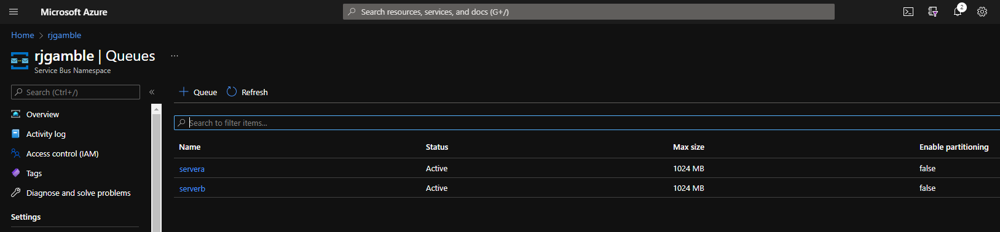
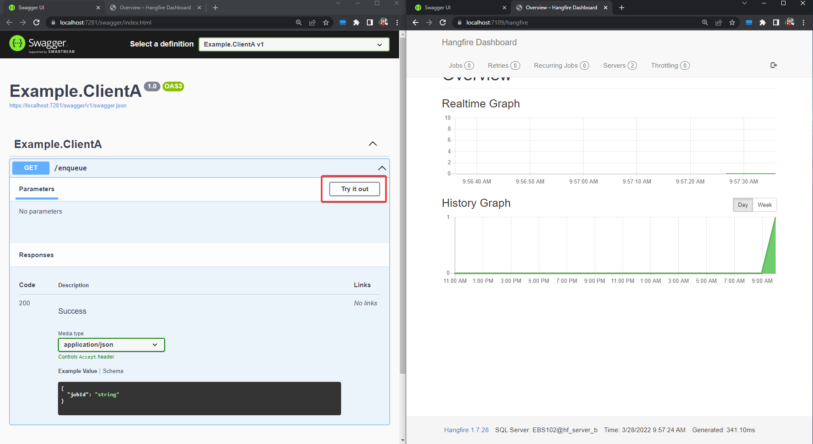
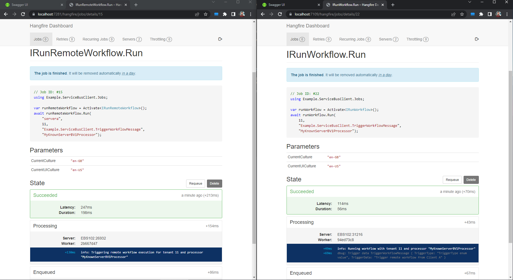

# Skills Lab: Remote Messaging With Hangfire & Azure Service Bus

In this skills lab I am exploring remote [Hangfire](https://docs.hangfire.io/en/latest/) job execution using a common pub/sub pattern with [Azure Service Bus](https://docs.microsoft.com/en-us/azure/service-bus-messaging/service-bus-messaging-overview).

## Prerequisites

In order to clone and run this project you must obtain the following:
* [Hangfire Ace](https://www.hangfire.io/ace/) licence with access to the private NuGet feed for throttling
* Access to a SQL Server instance with two databases on it using Windows authentication, `hf_server_a` and `hf_server_b`
* Azure subscription with a [Service Bus](https://docs.microsoft.com/en-us/azure/service-bus-messaging/service-bus-messaging-overview) resource:
    * Make sure you copy the connection string to add the `appsettings` later
    * Setup the following Queues in the Service Bus Namespace: `servera` and `serverb` 
      
    

## 🚧👷‍♂️ Build & Run

1. Roll through each of the `ServerX` and `ClientX` projects and create an `appsettings.Development.json` file
    1. For the `ClientX` project settings, specify the following:   
    ```json
    {
        "ConnectionStrings": {
            "HangfireConnection": "Server={YOUR SQL SERVER};Database={hf_server_a|hf_server_b};Trusted_Connection=True;",
            "ServiceBusConnection": "{YOUR SERVICE BUS CONNECTION STRING}"
	    }
    }
    ```
    1. For the `ServerX` project settings, specify the following:   
    ```json
    {
        "ConnectionStrings": {
            "HangfireConnection": "Server={YOUR SQL SERVER};Database={hf_server_a|hf_server_b};Trusted_Connection=True;",
            "ServiceBusConnection": "{YOUR SERVICE BUS CONNECTION STRING}"
        },
        "ServiceBusListeningQueueName": "{servera|serverb}"
    }
    ```
1. Configure the startup projects for the solution to start both `ServerX` and both `ClientX` applications

1. Run the solution


## ✅ Output

1. On startup, you should get two browser windows displaying the Swagger UI for each `ClientX`, split the windows side-by-side
1. Duplicate the Swagger UI tabs and change the URL to `/hangfire`, the Hangfire dashboard will appear
1. Against Server A Swagger UI, expand the `enqueue` endpoint and using the __Try It Out__ feature, make a request  
    
1. Switch to the Hangfire Dashboard tabs and observe the realtime graph report one job execution (on both sides)
1. In both dashboards, go to Jobs > Succeeded:  
    * On `ServerA` (source), you will see a successful job and console logs for `IRunRemoteWorkflow.Run`
    * On `ServerB` (subscribed listener), you will see a successful job and console logs for `IRunWorkflow.Run` which has received the message and performed the job, using message parameters

    
